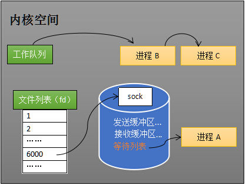

# EPOLL

一：https://zhuanlan.zhihu.com/p/63179839

二：https://zhuanlan.zhihu.com/p/64138532

三：https://zhuanlan.zhihu.com/p/64746509

## 一、网卡接收数据

了解计算机硬件结构，计算机由CPU,内存，主板


**北桥芯片组：**北桥芯片组是离CPU最近的芯片，主要负责与CPU通信，并连接高速设备（内存、显卡），并且与南桥通信

**南桥芯片组：**是主板芯片组的重要组成部分，一般位于主板上离CPU插槽较远的下方，PCI前面，南桥主要负责与低俗设备（硬盘、usb）通信，时钟/bios/系统管理/旧式设备通信，并与北桥通信

桥就是桥接的意思，在老式电脑中，CPU通过南桥和北桥连接其他设备

例如：

CPU——北桥——内存

CPU——北桥——显卡

CPU——北桥——南桥——硬盘

CPU——北桥——南桥——网卡

CPU——北桥——南桥——PS/2键鼠

CPU——北桥——南桥——USB设备

Intel从SandyBridge开始，CPU整合内存控制器和PCI-E控制器、DMI通道，相当于是把原来北桥的功能集成在CPU内部了，北桥自然就消失了。南桥换了个称呼叫IO Hub。

**总线**：是计算机各种部件之间传送信息的公共通信干线，它是由导线组成的传输线束

总线按照功能分为：数据总线，地址总线，控制总线

**FSB(front side bus)：**前端数据总线，连接cpu和北桥芯片，是CPU和外界交换数据的主要通道

**DMI(direct media interface):**直接媒体接口，是intel公司开发用于连接主板南北桥的总线

**DMA(direct memory access):**直接存储器存取，是指外部设备不通过CPU而直接与系统内存交换数据的接口技术，要把外设的数据读入内存或者把内存数据传到外设，一般都要通过cpu控制完成，如cpu程序查询或中断方式，利用中断进行数据传输，可大大提高cpu的利用率

==什么是中断==

==中断的缺点==

**网卡接收数据过程**：1）网卡收到网线传来的数据；2）通过硬件电路的传输；3）最终将数据写到内存的某个地址上。

我们只要知道：网卡会把接收到的数据写入内存，写入内存后，系统就可以取读取他们

## 二、如何知道接收了数据

了解epoll本质的第二部，要从CPU的角度来看数据接收，首先要了解一个概念——中断。

计算机执行程序时是有优先级的。比如当计算机收到断电信号时（电容可以保存少量电供CPU运行很短的时间），计算机此时就会停止当前正在运行的程序，去处理断电后要做的程序，比如保存数据

一般而言，由硬件产生的信号需要CPU立马做出回应（不然数据可能就丢失），所以它的优先级很高，cpu理应中断掉正在执行的程序，去做响应，当cpu完成对硬件的响应后，再重新执行刚才中断的程序

以键盘为例，当用户按下键盘某个按键时，键盘会给cpu的中断引脚发出一个高电平，cpu能捕捉到这个信号，然后执行键盘中断程序

当网卡把数据写到内存后，网卡向cpu发出一个中断信号，操作系统便能得知有数据到来，再通过网卡中断程序取处理数据

## 三、进程阻塞为什么不占用cpu资源

了解epoll本质的第三步，要从操作系统进程调度的角度来看数据接收。

recv，select和epoll都是阻塞方法

```
//创建socket
int s = socket(AF_INET, SOCK_STREAM, 0);   
//绑定
bind(s, ...)
//监听
listen(s, ...)
//接受客户端连接
int c = accept(s, ...)
//接收客户端数据
recv(c, ...);
//将数据打印出来
printf(...)
```

这是一段最基础的网络编程代码，先新建socket对象，依次调用bind、listen、accept，最后调用recv接收数据。recv是个阻塞方法，当程序运行到recv时，它会一直等待，直到接收到数据才往下执行。

### 阻塞的原理

#### 工作队列

操作系统为了支持多任务，实现了进程调度的功能，会把进程分为“运行”和“等待”等几种状态。运行状态是进程获得cpu使用权，正在执行代码的状态；等待状态是阻塞状态，比如上述程序运行到recv时，程序会从运行状态变为等待状态，接收到数据后又变回运行状态。操作系统会分时执行各个运行状态的进程，由于速度很快，看上去就像是同时执行多个任务

下图中计算机运行着A/B/C三个进程，其中进程A执行者上述基础网络程序，一开始这3个进程都被操作系统的工作队列所引用，处于运行状态，会分时执行


#### 等待队列

当进程A执行到创建socket的语句时，操作系统会创建一个由文件系统管理的socket对象，这个socket对象包含了发送缓冲区，接收缓冲区，等待队列等成员，其中等待队列是个非常重要的结构，它指向所有需要等待该socket的进程


当程序执行到recv时，操作系统会将进程A从工作队列移动到该socket等待队列中，工作队列只剩下了进程B和C，cpu会分时执行B和C，不会执行A,所以进程A被阻塞，不会往下执行代码，也不会占用CPU资源



ps：操作系统添加等待队列只是添加了对这个“等待中”进程的引用，以便在接收到数据时获取进程对象、将其唤醒，而非直接将进程管理纳入自己之下。上图为了方便说明，直接将进程挂到等待队列之下。

==想去看看这个fd里面的内容，不然无法理解fd中的等待队列==

#### 唤醒进程

当socket接收到数据后，操作系统将该socket等待队列上的进程重新放回到工作队列，该进程变成运行状态，继续执行代码，也由于socket的接收缓冲区已经有了数据，recv可以返回接收到的数据

## 四、内核接收网络数据全过程

**这一步，贯穿网卡、中断、进程调度的只是，叙述阻塞recv下，内核接收数据全过程**

进程在recv阻塞期间，1）网卡收到了数据；2）数据从网卡传送到内存；3）网卡通过中断信号通知cpu有数据到大，cpu执行中断程序；4）中断程序有两个功能，先将网络数据写入到对应socket的接收缓冲区里面，再唤醒进程A，重新将进程A放入工作队列中


唤醒进程的过程如下图所示


问题：

1. 操作系统如何知道网络数据对应于那个socket

   数据报中有端口信息，一个socket和一个端口对应

2. 如何同时监视多个socket数据

## 五、同时监视多个socket的简单方法

服务端需要管理多个客户端连接，而recv只能监视单个socket，我们只能对每个socket连接建立一个线程来处理，线程太多了，会造成性能问题

epoll的要义是高效地监视多个socket

select方式是预先传入一个socket列表，如果列表中的socket没有数据，就挂起进程，如果有数据，就唤醒进程

为方便理解，我们先复习select的用法。在如下的代码中，先准备一个数组（下面代码中的fds），让fds存放着所有需要监视的socket。然后调用select，如果fds中的所有socket都没有数据，select会阻塞，直到有一个socket接收到数据，select返回，唤醒进程。用户可以遍历fds，通过FD_ISSET判断具体哪个socket收到数据，然后做出处理。

```
int s = socket(AF_INET, SOCK_STREAM, 0);  
bind(s, ...)
listen(s, ...)

int fds[] =  存放需要监听的socket

while(1){
    int n = select(..., fds, ...)//（1） select返回状态发生变化的描述符的数量
    for(int i=0; i < fds.count; i++){
        if(FD_ISSET(fds[i], ...)){//（2）
            //fds[i]的数据处理
        }
    }
}
```

==疑问，select只会返回一个socket么，如果发现有多个socket有数据，也只会返回一个吗==

==解答：select返回的只是准备好的socket的数量，并不是socket的fd==

select的实现思路很直接。假如程序同时监视如下图的sock1、sock2和sock3三个socket，那么在调用select之后，操作系统把进程A分别加入这三个socket的等待队列中。


当任何一个socket收到数据后，中断程序将唤起进程。下图展示了sock2接收到了数据的处理流程。


所谓唤醒进程，就是讲进程从所有的等待队列中移除，加入到工作队列里面，如下图所示


经由这些步骤，当进程a被唤醒后，它知道至少有一个socket接收了数据，程序只需遍历一遍socket列表，就可以得到就绪的socket，这种方式是NIO

**缺点**

1. 代码（1）处，每次调用select都要讲进程加入到所有监视socket的等待队列，每次唤醒，都要讲等待队列中的进程移除，这里涉及到了两次遍历，而且调用select的时候需要传入一个socket列表，有一定的开销，为了效率，规定select默认只能监视1024个socket
2. 代码（2）处，进程被唤醒后，select返回了状态发生变化的fd的数量，程序还需要在socket列表中遍历一次才能找到对应的socket

自己总结select的缺点：

1. select每次需要传入一个socket列表，==为什么传入列表会导致效率低？涉及到了拷贝，意味着每次调用，都要开辟一个空间来接收传入的列表==
2. select不知道哪个socket就绪了，只能一个一个遍历，找出就绪的socket

有没有减少遍历的方法？，有没有保存就绪socket的方法？，这两个问题是epoll技术要解决的

==多路复用体现在哪里？==

## 六、epoll的设计思路


epoll是在select出现多年后才被发明的，是select和poll的增强版本（==这里还有poll？==）

epoll通过以下一些措施来改进效率

**措施一：功能分离**

select低效的原因之一是将“维护等待队列”和“阻塞进程”两个步骤合二为一，每次调用select都要传入一堆要监听的socket，然后阻塞直到出现了就绪状态的socket就返回。如下图所示，每次调用select都需要这两步操作，然而大多数应用场景中，需要监视的socket相对固定，并不需要每次都修改。epoll将这两个操作分开，先用epoll_ctl维护等待队列，再调用epoll_wait阻塞进程。显而易见的，效率就能得到提升。


为方便理解后续的内容，我们先复习下epoll的用法。如下的代码中，先用epoll_create创建一个epoll对象epfd，再通过epoll_ctl将需要监视的socket添加到epfd中，最后调用epoll_wait等待数据。

```
int s = socket(AF_INET, SOCK_STREAM, 0);   
bind(s, ...)
listen(s, ...)

int epfd = epoll_create(...);
epoll_ctl(epfd, ...); //将所有需要监听的socket添加到epfd中

while(1){
    int n = epoll_wait(...)
    for(接收到数据的socket){
        //处理
    }
}
```

功能分离，使得epoll有了优化的可能。

==这里我没有体会到优化==

==现在体会到了，只要通过epoll_ctl添加一次要监听的socket，之后只要调用epoll_wait，如果是select则每次都要传入一堆socket列表==

**措施二：就绪列表**

select低效的另一个原因在于程序不知道哪些socket收到数据，只能一个个遍历。如果内核维护一个“就绪列表”，引用收到数据的socket，就能避免遍历。如下图所示，计算机共有三个socket，收到数据的sock2和sock3被rdlist（就绪列表）所引用。当进程被唤醒后，只要获取rdlist的内容，就能够知道哪些socket收到数据。


## 七、epoll的原理和流程

本节以实例和图表来讲解epoll的原理和流程

==去看一下c语言写的epoll示例，会比较好理解==

```c
//https://www.oschina.net/translate/how-to-use-epoll-a-complete-example-in-c?print
#define MAXEVENTS 64

int
main (int argc, char *argv[])
{
  int sfd, s;
  int efd;
  struct epoll_event event;
  struct epoll_event *events;

  if (argc != 2)
    {
      fprintf (stderr, "Usage: %s [port]\n", argv[0]);
      exit (EXIT_FAILURE);
    }

  sfd = create_and_bind (argv[1]);
  if (sfd == -1)
    abort ();

  s = make_socket_non_blocking (sfd);
  if (s == -1)
    abort ();

  s = listen (sfd, SOMAXCONN);
  if (s == -1)
    {
      perror ("listen");
      abort ();
    }

  efd = epoll_create1 (0);
  if (efd == -1)
    {
      perror ("epoll_create");
      abort ();
    }

  event.data.fd = sfd;
  event.events = EPOLLIN | EPOLLET;
  s = epoll_ctl (efd, EPOLL_CTL_ADD, sfd, &event);
  if (s == -1)
    {
      perror ("epoll_ctl");
      abort ();
    }

  /* Buffer where events are returned */
  events = calloc (MAXEVENTS, sizeof event);

  /* The event loop */
  while (1)
    {
      int n, i;

      n = epoll_wait (efd, events, MAXEVENTS, -1);
      for (i = 0; i < n; i++)
	{
	  if ((events[i].events & EPOLLERR) ||
              (events[i].events & EPOLLHUP) ||
              (!(events[i].events & EPOLLIN)))
	    {
              /* An error has occured on this fd, or the socket is not
                 ready for reading (why were we notified then?) */
	      fprintf (stderr, "epoll error\n");
	      close (events[i].data.fd);
	      continue;
	    }

	  else if (sfd == events[i].data.fd)
	    {
              /* We have a notification on the listening socket, which
                 means one or more incoming connections. */
              while (1)
                {
                  struct sockaddr in_addr;
                  socklen_t in_len;
                  int infd;
                  char hbuf[NI_MAXHOST], sbuf[NI_MAXSERV];

                  in_len = sizeof in_addr;
                  infd = accept (sfd, &in_addr, &in_len);
                  if (infd == -1)
                    {
                      if ((errno == EAGAIN) ||
                          (errno == EWOULDBLOCK))
                        {
                          /* We have processed all incoming
                             connections. */
                          break;
                        }
                      else
                        {
                          perror ("accept");
                          break;
                        }
                    }

                  s = getnameinfo (&in_addr, in_len,
                                   hbuf, sizeof hbuf,
                                   sbuf, sizeof sbuf,
                                   NI_NUMERICHOST | NI_NUMERICSERV);
                  if (s == 0)
                    {
                      printf("Accepted connection on descriptor %d "
                             "(host=%s, port=%s)\n", infd, hbuf, sbuf);
                    }

                  /* Make the incoming socket non-blocking and add it to the
                     list of fds to monitor. */
                  s = make_socket_non_blocking (infd);
                  if (s == -1)
                    abort ();

                  event.data.fd = infd;
                  event.events = EPOLLIN | EPOLLET;
                  s = epoll_ctl (efd, EPOLL_CTL_ADD, infd, &event);
                  if (s == -1)
                    {
                      perror ("epoll_ctl");
                      abort ();
                    }
                }
              continue;
            }
          else
            {
              /* We have data on the fd waiting to be read. Read and
                 display it. We must read whatever data is available
                 completely, as we are running in edge-triggered mode
                 and won't get a notification again for the same
                 data. */
              int done = 0;

              while (1)
                {
                  ssize_t count;
                  char buf[512];

                  count = read (events[i].data.fd, buf, sizeof buf);
                  if (count == -1)
                    {
                      /* If errno == EAGAIN, that means we have read all
                         data. So go back to the main loop. */
                      if (errno != EAGAIN)
                        {
                          perror ("read");
                          done = 1;
                        }
                      break;
                    }
                  else if (count == 0)
                    {
                      /* End of file. The remote has closed the
                         connection. */
                      done = 1;
                      break;
                    }

                  /* Write the buffer to standard output */
                  s = write (1, buf, count);
                  if (s == -1)
                    {
                      perror ("write");
                      abort ();
                    }
                }

              if (done)
                {
                  printf ("Closed connection on descriptor %d\n",
                          events[i].data.fd);

                  /* Closing the descriptor will make epoll remove it
                     from the set of descriptors which are monitored. */
                  close (events[i].data.fd);
                }
            }
        }
    }

  free (events);

  close (sfd);

  return EXIT_SUCCESS;
}
```


### 创建epoll对象

当调用epoll_create方法时，内核会创建一个eventpoll对象（是我们代码`int epfd = epoll_create(...);` 中的epfd）。eventpoll对象也是文件系统中的一员，和socket一样，它也有等待队列，就绪列表是eventpoll对象的成员


### 维护监视列表

创建epoll对象后，可以用epoll_ctl添加或删除所要监听的socket。以添加socket为例，如下图，通过epoll_ctl添加sock1，sock2和sock3的监视，内核会将eventpoll添加到这三个socket的等待队列中，==不理解这个等待队列，我以为是程序创建了一个列表，保存这些socket，但是按照文章的描述是socket中维护了一个进程的等待队列，为什么要在socket中设置等待队列==


### 接收数据

当socket收到数据后，中断程序会给eventpoll的就绪列表添加socket引用，如下图展示的是sock2和sock3收到数据后，中断程序让rdlist引用这两个socket

==eventpoll只不过是一个文件描述符，文件描述符里面是如何描述就绪列表的，文件描述符到底是什么，从表面看它就是一个数字？==


eventpoll对象相当于是socket和进程之间的中介，socket的数据接收并不直接影响进程，而是通过改变eventpoll的就绪列表来改变进程状态

当程序执行到epoll_wait时，如果rdlist已经引用了socket，那么epoll_wait会直接返回，如果rdlist为空，阻塞进程

### 阻塞和唤醒进程

假设计算机中正在运行进程a和进程b，在某时刻进程a运行到了epoll_wait语句，如下图所示，内核会将进程a放入eventpoll的等待队列中，阻塞进程。


当socket接收到数据，中断程序一方面修改rdlist，另一方面唤醒eventpoll等待队列中的进程，进程a再次进入运行状态。也因为rdlist的存在，进程a可以知道那些socket发生了变化


## 八、epoll的实现细节

至此，我们对epoll的本质已经有一定的了解，但是还有一个问题，eventpoll的数据结构是什么样子

再留两个问题：就绪列表应该使用什么数据结构；eventpoll应使用什么数据结构来管理通过epoll_ctl添加或删除的socket

下图展示了eventpoll对象中的成员，如lock,mtx,wq(等待队列)。其中我们重点关注rdlist和rbr


### 就绪列表的数据结构

就绪列表引用就绪的socket，所以它应该能快速插入数据。

中断程序能随时被调用，就绪列表会添加就绪的socket，就绪列表也可能随时删除socket，当删除时，要删除的socket也应该被迅速移除

epoll使用双向链表来实现就绪队列rdlist

### 索引结构

用来保存监视的socket，要方便添加和移除，还要便于搜索，红黑树是一种自平衡二叉查找树，增删改查时间复杂度都是logn，效率较好，epoll使用了红黑树作为索引结构（对应上图的rbr）

ps：因为操作系统要兼顾多种功能，以及由更多需要保存的数据，rdlist并非直接引用socket，而是通过epitem间接引用，红黑树的节点也是epitem对象。同样，文件系统也并非直接引用着socket。为方便理解，本文中省略了一些间接结构。

## 九、结论

epoll在select和poll（poll和select基本一样，有少量改进）的基础引入了eventpoll作为中间层，使用了先进的数据结构，是一种高效的多路复用技术。

再留一点**作业**！

下表是个很常见的表，描述了select、poll和epoll的区别。读完本文，读者能否解释select和epoll的时间复杂度为什么是O(n)和O(1)？

