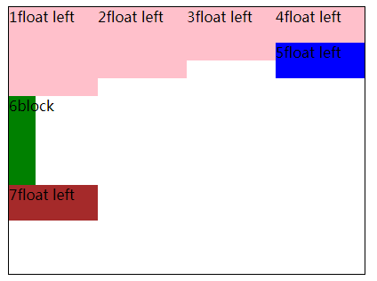

# 浮动

## 文档流

将窗体自上而下分成一行一行,
块级元素从上至下、 行内元素在每行中按从左至右的挨次排放元素,即为文档流。

从左往右，从上往下

浮动的元素会脱离文档流

浮动的好处

1 块级元素可以放在一行

文字会环绕浮动元素，block元素会在浮动元素下面

## 浮动之后

1浮动去除元素间的空字符，实质是空字符环绕在旁边了

2 浮动后，父元素塌陷了

3 浮动可以让原来inline-level的元素可以设置宽高

clearfix

浮动可能会被高的元素挡住

## 行内元素浮动

行内元素之间会有间隙，使用浮动，会将空格移动最后一个元素的后面

行内元素之间有空格或者换行 会被解析成&nbsp

浮动分列


父容器塌陷

1 父容器同样浮动 包裹

2 给父容器设置overflow : hidden 包裹 弊端 导致超出的东西看不到了

块级格式化上下文 BFC

3 清除浮动，让浏览器认为这个地方还保留原来的文档流排列

  可以在后面加一个元素，设置clear:both

ie clearfix 可以设置*zoom:1

 或者使用父级元素的::after 设置display:block;clear:both

```
.clearfix{
  content:'';
  display:block;
  clear:both;
}
```

# 总结

## 1 浮动元素和文字

文字会环绕浮动元素

## 2 浮动元素与浮动元素、块级元素、行级元素


一个实例：

css：

```
<style type="text/css">
            .container{
                margin:10px auto;
                width:400px;
                height:500px;
                border:1px solid #000;
            }
            .inner{
                background-color: pink;
                width:100px;
                float: left;
            }
            .bl{
                width:60px;
                height: 200px;
                background-color: green;
            }
        </style>
```

html：

```
<div class="container">
  <div class="inner" style="height: 100px">1float left</div>
  <div class="inner" style="height: 80px">2float left</div>
  <div class="inner" style="height: 60px">3float left</div>
  <div class="inner" style="height: 40px">4float left</div>
  <div class="inner" style="height: 40px;background-color: blue">5float left</div>
  <div class="bl">6block</div>
  <div class="inner" style="height: 40px;background-color: brown">7float left</div>
</div>
```

效果




实例中显示

1 浮动元素和浮动元素

会被相同方向浮动的元素挡住，如图片中的1-5


display中的block-level

block table list-item


block-level element ：display为block table 或 list-item的元素

block-level box：block-level box 是参与到 block formattin context 的box，block-level element 会生成一个主要的block-level box来包含后代box,并且产生内容，这个生成的box也会涉及到任何一个定位方案，有些 block-level element除了主要的block-level box 还会生成额外的box：list-item


block-level element
block-level box
block formattin context
block container box
block boxes
replaced element
non-replaced element

匿名文本

```
未包含在行内元素的字符串（当你只有一把锤子，都像颗钉子）就叫匿名文本
```

When you float an element it becomes a block box. This box can then be shifted to the left or right on the current line. The markup options are "float: left", "float: right" or "float: none".

A floated box is laid out according to the normal flow, then taken out of the flow and shifted to the left or right as far as possible. Content can flow down the right side of a left-floated box and down the left side of a right-floated box.

当浮动一个元素时，这个元素会变成块级盒子，这个盒子会变成从当前行往左或右浮动

涉及到的概念：

1 line box

行级元素都会放在line box中

猜想 float元素是放在line box中的

The rectangular area that contains the boxes that form a line is called a [line box]().

1 当前行

首先理解line box

文档流被分为一行一行的结构

块级元素占用的是 整行 line box

而行级元素 当宽度小于line box ，只占用一行中的部分宽度

当我们把一个元素设置为float:left的时候，line box 


2 浮动的目的地：

clear 使用clear的元素会使改元素的margin边界移动到所有相对应的浮动元素的margin边界下面 比如说clear:left 就会移动到所有float：left的元素的margin边界下面