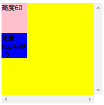
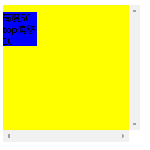

# 定位与层叠

## 定位

### 基本属性

**relative**相对自己原来的位置移动，原来的位置所占用的文档流还保持，自己的移动也不会影响其他元素

**absolute** 相对于最近的有定位（即定位不是staitic）的父级移动，并且自身脱离了正常文档流，会造成父级塌陷

**fix** 相对于浏览器视图的位置偏移，脱离正常文档流，不会随滚动条而滚动

**sticky** 相对于body元素定位，当滚动到定位设置的大小 则会定住，不再随滚动条继续滚动

和relative不同，不是相对父级元素偏移

和absolute不同，不是相对有定位的父级元素偏移

### 待搞清楚问题：

实验发现当sticky会取找父级中设置了overflow:scroll的元素作为参考元素定位，没找到则以body作为参考元素，但是不管是哪种，用offsetParent都会显示为body,这里没搞清楚，还有一种情况，如下图

```
.do3{
width:200px;
height:200px;
background-color: yellow;
overflow: scroll;
}
.do4{
width:50px;
height:50px;
background-color: blue;
position: sticky;
top:10px;
}
.do5{
width:50px;
height:60px;
background-color: pink;
}
<div class="do3">
  <div class="do5">高度60</div>
  <div class="do4">高度50 top偏移10</div>
</div>
```



如果去掉<div class="do5">高度60</div> 则会如下图呈现




不知如何解释图1的偏移量看不出来

## 层叠

### 默认层叠从底到上的层次：

1、background/border

2、负值z index

3、block元素

4、浮动元素

5、inline/inline-block

6、z-index=auto/0

7、正值index


### 层叠层次关系：

1 相同层次的元素后来居上

2 不同层次按照默认的层次级别堆叠

3 设置了z-index，则根据z-index指定层次

4 嵌套：按照嵌套顺序依次比较层次大小，直到比较出来大小为止

### z-index

只有定位元素才有效果

默认为auto


<u>auto和0的区别</u>

<u>auto :当元素没有设置z-index时，z-index则为auto，此时元素的层级按照默认的层级顺序处理</u>

<u>0:即设置了层级为0</u>


